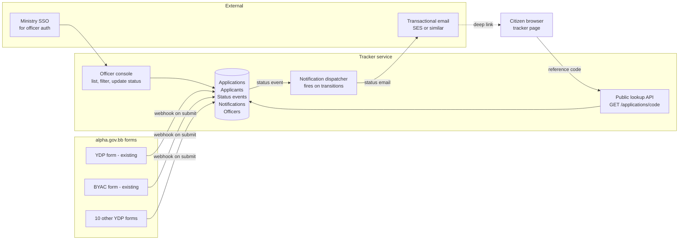

# Application tracker – pilot brief

A short brief describing how to pilot the application tracker with the Ministry of Youth, Sport and Community Engagement, the service patterns to put in place, and what the backend should look like.

## Why this ministry, why now

The ministry already has twelve youth-development services either live on alpha.gov.bb or in the alpha.gov.bb pipeline. That gives the pilot four advantages: a real, captive audience of applicants; consistent intake forms already on the GovBB design system; a single accountable senior owner; and a high-volume, time-bound flow (most YDP intakes are seasonal cohorts, so you can measure a complete cycle in weeks, not years). It also tests the hardest version of the assumption – that a tracker reduces "where is my application?" inbound when the cohort is expecting a decision by a deadline.

## A test-and-learn shape that fits in a quarter

I'd resist building once for all twelve programmes. Instead:

**Weeks 1–2: discovery with the ministry.** Shadow the officers who actually triage these applications today. Get the YDP head, the BYAC programme manager, and one front-line officer in a room. Walk every step from "applicant clicks submit" to "applicant is told the outcome". Capture: which programmes get the most "where's my application?" emails and calls; what those applicants are actually asking; how officers update their internal records today (spreadsheet, paper, departmental CMS, email folders). Get a rough baseline of inbound contact volume by programme – even a one-week tally is enough.

**Weeks 3–4: pick one programme and design with officers.** I'd suggest **Get Hired** or **BYAC** as the first cab off the rank, on the assumption they're highest-volume and have the shortest cycle. Co-design the status taxonomy with officers in a workshop – the generic six-status model is a starting point, not a finished thing. They will tell you that, for example, "interview scheduled" and "interview missed" need to be distinct states for Get Hired. Lock that down.

**Weeks 5–8: build the MVP for that one programme.** Confirmation page change on the existing form, transactional emails, citizen tracker page, minimal officer back-office, status-change notification engine. Skip the chat – that's a v2 feature. Skip filtering and bulk actions in the back-office – officers can manage with a basic list for one programme.

**Weeks 9–12: live with one cohort, measure, decide.** Soft-launch with a single cohort. Measure (see below). Don't onboard programme #2 until you've made the changes the first cohort told you to make.

**Weeks 13+: roll out in batches of three or four programmes.** By then the platform is stable and the rollout is operational, not redesign.

## The pattern you described, with a few sharpening edits

You're right on both fronts. The confirmation page and email should send people to the tracker, and significant status changes should trigger an email. Three additions worth making before you build it.

**The reference code is the authentication.** No password, no login. That works only if the code is hard to guess – aim for something like `YDP-2026-A4F2K9X` (programme prefix + year + 7 random base32 characters, around 35 bits of entropy). And it dictates what the tracker is allowed to show. The tracker can show the applicant's first name (they already know it), the programme, the current status, the timeline, and the department contact. It must not show date of birth, NRN, address, or anything an attacker who happened to know one applicant's code shouldn't see about another. Treat the code as a moderate secret.

**Email is a nudge, not a payload.** The email body should contain the bare minimum: "Your application has been updated" + a one-line summary + a link to the tracker. No personal data in the email. No screenshots of the form. This keeps you out of trouble if an applicant's inbox is shared, forwarded or compromised, and makes the tracker the single source of truth.

**Send notifications only on "significant" transitions, and throttle.** A reasonable rule: notify on `received → action_needed`, `under_review → action_needed`, any `→ approved`, any `→ rejected`, any `→ completed`. Do not notify on `received → under_review` (an officer just picking up a queue – noise to the citizen). Do not notify on internal-note edits. And cap notifications at one per applicant per day – so an officer who fixes a typo on the message doesn't trigger two emails.

**The confirmation moment is the most important page in the service.** It's where you set every expectation that the tracker then has to honour. Include a clear "what happens next and roughly when" – e.g. "We'll review your BYAC application by Friday 5 June. We'll email you when the status changes." That single sentence is what the GovTech research (42% want to see status online; 67% want to know what to expect) is asking for.

## What the backend should look like

A small system, not a big one. The whole thing is essentially a state machine over an append-only log of status events, with notifications hung off transitions.

**Data model.** Six tables, all append-only-friendly:

- `programmes` – id, name, ministry, default_sla_days, allowed_statuses (so different programmes can have different state machines without forking the code)
- `applications` – id, code, programme_id, applicant_id, current_status, current_status_at, assigned_officer_id, created_at
- `applicants` – id, name, email, phone (sourced from form submission)
- `status_events` – id, application_id, status, citizen_message, internal_note, by_officer_id, created_at (this is the timeline; never updated, only inserted)
- `notifications` – id, application_id, kind, channel, recipient, sent_at, message_id (audit log of what we sent and to whom)
- `officers` – id, name, email, ministry, role (synced from SSO)

The `status_events` table is the source of truth. `applications.current_status` is a derived cache for fast list/filter; rebuild it from the latest event if you ever doubt it.

**Three services, deliberately small.**

1. **Form intake** – an HTTPS webhook that the existing alpha.gov.bb form framework calls on submit. It creates an `application` and the first `status_event` of `received`. The current `govtech-forms` project already POSTs form submissions somewhere; this is one more receiver.
2. **Officer console** – the back-office UI you've already prototyped. Officer auth via SSO. PATCH endpoint that writes a new `status_event` and updates the cached `current_status`. That's the only write path.
3. **Notification dispatcher** – subscribes to `status_event` inserts, applies the "significant transition" rule, deduplicates within 24 hours, and dispatches via the email provider. Records every send in `notifications`.

**Public lookup API.** One endpoint: `GET /applications/{code}`, no auth, returns only the safe fields. Rate-limit by IP to make brute force expensive (codes have ~35 bits of entropy, so even modest rate-limiting is sufficient).

**Reference codes.** Generate at intake. Format `YDP-2026-A4F2K9X` so the prefix tells you the programme, the year tells you when, and the seven base32 characters give you the entropy. Use a base32 alphabet that excludes `0/O/I/1` so codes are easier to type from a phone screen.

**What to reuse vs build new.** Reuse the alpha.gov.bb header/footer chrome, the GovBB design tokens, the existing forms framework's submit pipeline, and (if it exists) GovTech's existing email-sending infrastructure. Build new: the data model, the officer console, the notification dispatcher, the public tracker page. The whole thing should be a single Node service plus Postgres for the pilot.

## What to measure, tied to GovTech's existing research

The research gives you ready-made benchmarks. Pick two primary metrics and a handful of secondary ones.

**Primary.** Inbound "where's my application?" contact volume to the ministry – calls, emails, walk-ins – before and during the pilot, expressed as a rate per 100 active applications. This is the metric Mark Boyce's research implies (42% want status online; "slow processing times was a universal complaint"). If you reduce this by a third, the case for rollout writes itself.

**Secondary.** Tracker activation rate (percentage of applicants who view their tracker page at least once); status email click-through rate; officer time-to-first-status-update (a behavioural signal of whether officers are actually using the back-office); citizen satisfaction via a one-question post-tracker survey ("Did this page tell you what you needed to know? Yes/No/Sort of"); and the proportion of applicants who report "I knew what was happening" in the post-cohort survey.

## Risks worth naming early

**Officer adoption is the single biggest risk.** A tracker that officers don't update is worse than no tracker, because the citizen-facing copy will lie. The back-office has to be cheaper than not using it – which usually means making it the place where officers do their actual work, not a parallel system they have to remember to copy into. The discovery sprint should explicitly answer: "What system are officers using today, and can we replace it, or do we need to integrate?"

**The status taxonomy might need to be programme-specific.** Get Hired (interviews, placements) has different decision points from BYAC (cohort enrolment) and Job Start Plus. The data model handles this with `programmes.allowed_statuses`; the design conversation has to actually do it.

**Data sovereignty.** The applications data belongs to the ministry, not GovTech. Agree the data-sharing arrangement up front – who can read what, who's the data controller, retention period, what happens at end of pilot if it doesn't expand.

**Minors.** Several of these programmes serve under-18s. Confirm: who receives the tracker link – the applicant or a parent/guardian? What does the email body look like for a 16-year-old? This is a content design question, not a technical one, but it's worth raising in week one.

**Reference-code recovery.** Some applicants will lose the email. Build a "I've lost my code" flow into the tracker that asks for name, programme, and one verifiable detail, and routes to an officer rather than auto-recovering – low risk of impersonation, low automation cost, and it doubles as user research data on how often this happens.

## Suggested first-meeting agenda with the ministry

A 90-minute working session, not a presentation. Walk in with the citizen-side prototype open on a laptop, the officer console on another, and these prompts:

1. Pick one programme from the twelve to go first. Why that one?
2. Walk us through what happens today between "applicant submits" and "applicant gets a decision". (Whiteboard the steps.)
3. How do applicants ask "where is my application?" today, and how often?
4. Whose job changes if we put this in place? What's hard about that?
5. What would you need to see in four weeks for this to feel worth continuing?

Leave with: the chosen programme, named officer participants for the design workshop, an inbound-volume baseline commitment, and an agreed go/no-go date for the MVP.
